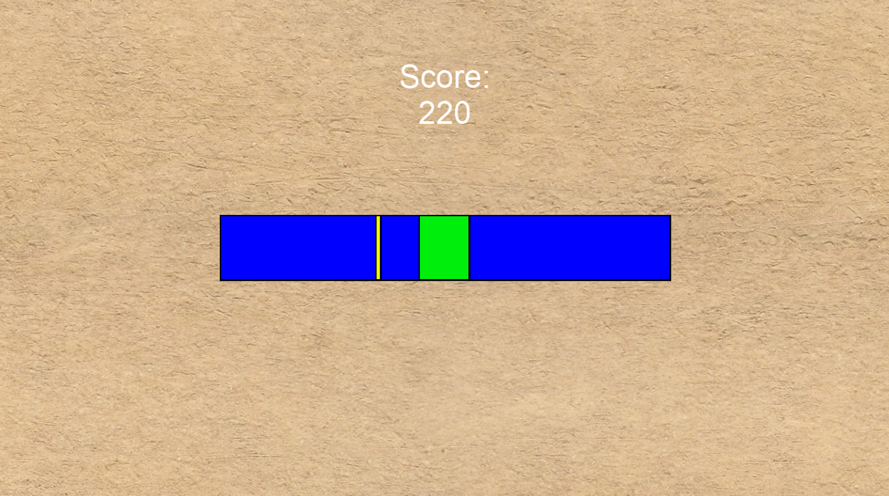
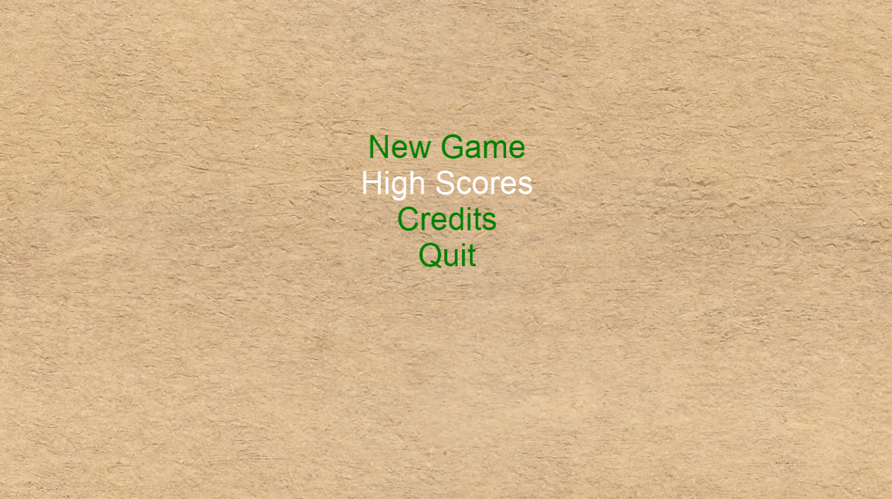

# MonoGameMidterm

## Description
This is a simple minigame developed in under 4 hours. A marker moves back and forth within a meter containing a target area. The user is to press SPACE when the marker is in the target area. If successful, the player scores points and the target area gets smaller. If unsuccessful, the game is over and the scored is saved persistent to local storage.

Features I'm most proud of:
1. Though simple, this game was developed quickly and completely.
2. Tasteful particle effect when the user is successful.
3. High scores persisted to local storage

## Build Instructions
1. Install Visual Studio
2. Run the `.sln` file in the root directory

## Gameplay Images

